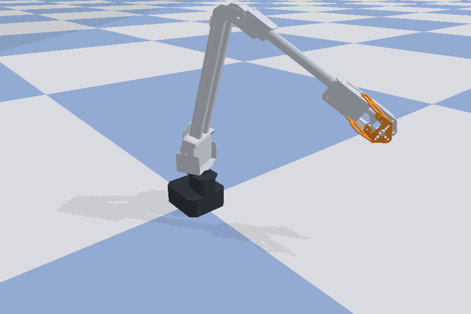

# roarm-ml

Simulation, control and reinforcement learning for the
[Waveshare RoArm-M2](https://www.waveshare.com/roarm-m2-s.htm), a 4-DOF desktop
robot arm ([product page](https://www.waveshare.com/roarm-m2-s.htm),
[wiki](https://www.waveshare.com/wiki/RoArm-M2-S)).



*The arm as rendered by this project's simulator, using Waveshare's
[official robot model](https://github.com/waveshareteam/roarm_ws). For photos
of the physical arm, see the product page.*

The idea: one PyBullet model of the arm that you can drive by hand, mirror
onto the real robot, and train an RL policy against, all through the same
joint vector so nothing needs translating between sim and hardware.

## What's in here

| Module | What it does |
| --- | --- |
| `roarm_rl/sim.py` | `RoArmSim`: PyBullet wrapper with joint control, FK/IK and joint limits |
| `roarm_rl/app.py` | Interactive 3D GUI: keyboard control, click-and-drag on the arm, voice and chat |
| `roarm_rl/picking.py` | Mouse-ray math behind the click-and-drag |
| `roarm_rl/hardware.py` | `RoArmHardware`: mirrors joint targets to a real arm via `roarm_sdk` |
| `roarm_rl/gesture.py` | Plays keyframe gestures on a Catmull-Rom spline, in sim or on the arm |
| `roarm_rl/library.py` | 66 hand-designed motions with speed, size and side variants |
| `roarm_rl/intent.py` | Maps a line of chat text to gestures (offline keyword matching) |
| `roarm_rl/server.py` | Web app server: streams the arm to browsers, takes commands |
| `roarm_rl/web/` | The web page: 3D view, chat, voice, gestures, learning |
| `roarm_rl/brain.py` | Learns preferences, skills and corrections from use |
| `roarm_rl/chat.py` | The desktop chat window |
| `roarm_rl/voice.py` | Microphone to text, offline (faster-whisper) |
| `roarm_rl/composer.py` | Invents a gesture for an unknown phrase via an external language model |
| `gestures/learned.json` | Gestures invented so far |
| `roarm_rl/env.py` | `RoArmReachEnv`: Gymnasium reach task |
| `roarm_rl/train.py` | PPO training and evaluation (Stable-Baselines3) |
| `roarm_rl/main.py` | CLI entry point for the GUI |
| `assets/` | RoArm-M2 URDF and meshes (from Waveshare, see [NOTICE.md](NOTICE.md)) |

Joint order everywhere is `[base, shoulder, elbow, gripper]` in radians. This
matches `roarm_sdk.joints_radian_ctrl`, so a joint vector that is valid in the
simulator can be sent straight to the real arm. Sim joint limits are the
intersection of the URDF limits and the SDK's firmware limits, so the sim
never produces a pose the arm would refuse.

## Setup

```
python -m venv .venv
.venv\Scripts\activate          # Linux/macOS: source .venv/bin/activate
pip install -r requirements.txt
```

**Windows note:** `pybullet` has no official prebuilt wheel for Windows on
recent Python versions, so `pip install pybullet` tries to compile from source
and fails without the
[MSVC Build Tools](https://visualstudio.microsoft.com/visual-cpp-build-tools/).
Either install those, or `pip install pybullet-arm64` instead: a community
fork that ships a precompiled Windows wheel and is a drop-in replacement
(`import pybullet` still works). This project was developed with the fork on
Python 3.11.

`roarm-sdk` and `pyserial` are only needed to drive a real arm; `gymnasium`
and `stable-baselines3` only for training.

## Web app

```
python -m roarm_rl.server                  # open http://127.0.0.1:8000
python -m roarm_rl.server --lan            # also from a phone on the same Wi-Fi
python -m roarm_rl.server --lan --https    # needed for the phone's microphone
python -m roarm_rl.server --hw serial --port COM5
```

One page, laid out for a desktop or a phone:

- **3D view** of the arm, drawn in the browser with three.js from the poses
  the server streams. Drag to orbit, pinch or scroll to zoom.
- **Chat**: type or tap the microphone and speak. Each reply has *Good* and
  *Not like that* buttons.
- **Gestures**: every motion as a card; pick speed, size and side, tap to play.
- **Learning**: what the arm has picked up (see below).
- **Control**: joint sliders, and the switch that mirrors to the real arm.

Every open browser sees the same arm and the same conversation.

The page records speech in the browser and the server transcribes it with
faster-whisper, so nothing depends on the PC's own microphone. Browsers only
allow the microphone on a secure page: `127.0.0.1` counts, a phone needs
`--https`. That flag creates a self-signed certificate with `openssl` in
`certs/` (git-ignored), and the phone shows a warning once.

With `--lan` the server prints a link containing an access code. Devices
without it are refused, because anyone who can reach the page can move the
arm. Keep the link to yourself and only use `--lan` on a network you trust.

The page loads three.js from a CDN, so the device needs internet access the
first time.

### What it learns from use

`roarm_rl/brain.py` learns from ordinary operation, with no training runs:

- **Preferences.** *Good* / *Not like that*, and a `stop` in the middle of a
  gesture, are rewards for the speed and size that was played. When you don't
  say how fast or how big, it plays the best-rated variant for that motion
  and, one time in ten, tries a neighbouring one to see if you like it better
  (a multi-armed bandit).
- **Skills.** `learn greeting: wave, then bow`, or after any command
  `remember that as greeting`. Saying `greeting` then runs it. `forget
  greeting` removes it.
- **Corrections.** `no, I meant wave` plays a wave and remembers that the
  previous phrase means wave.
- **New gestures**, through the optional designer command described below.

The Learning tab shows the counts, a 14-day activity chart, which speeds and
sizes have been liked, the skills, and recent lessons.

Skills, corrections and invented gestures are saved in
`gestures/learned.json`. The log of what was said and the preference counts
are in `data/`, which is git-ignored.

This is learning about *what you want*, not motor learning: the motions
themselves are still keyframes, and nothing here trains a neural network.

## Desktop GUI

```
python -m roarm_rl.main                              # sim only
python -m roarm_rl.main --hw serial --port COM5      # real arm over USB
python -m roarm_rl.main --hw http --host 192.168.4.1 # real arm over WiFi (AP mode default IP)
```

| Key | Action |
| --- | --- |
| `M` | toggle Joint mode / IK-XYZ mode |
| `LEFT` / `RIGHT` | Joint: base. IK: target X |
| `UP` / `DOWN` | Joint: shoulder. IK: target Y |
| `PAGE UP` / `PAGE DOWN` | Joint: elbow. IK: target Z |
| `,` / `.` | gripper close / open |
| `P` | toggle "Mirror to Real Robot" |
| `H` | send HOME pose |
| `T` | toggle hardware torque |
| `ESC` | quit |

You can also click and drag the arm itself to move the hand in 3D. The drag
happens in the plane facing the camera at the depth you grabbed, so orbit the
camera first to reach a different depth.

Mirroring is off by default even when `--hw` connects. Once on, joint targets
are throttled to about 12 Hz so the servo bus isn't flooded.

## Talking to the arm

The GUI opens a second window. Speak, or type and press Enter; the reply
shows which gestures were picked, and they play in the simulator (and on the
real arm when mirroring is on).

```
hello
nod twice then wave slowly
give me a strong nod
point right
thanks, that was great!
pretend you are a snake being charmed
stop
```

- Words like `slowly` / `fast`, `small` / `big` / `strong`, `left` / `right`
  and counts like `twice` or `3 times` choose the variant.
- `then`, `and` or a comma chains gestures.
- It also reacts to plain remarks: `good job` celebrates, `no way` acts
  surprised, `good night` goes to sleep.
- `help` lists every motion. `stop`, `H`, or grabbing the arm with the mouse
  cancels what is playing.

**Voice** (`roarm_rl/voice.py`) is offline: the microphone stream is cut into
utterances by loudness and transcribed with
[faster-whisper](https://github.com/SYSTRAN/faster-whisper) on the CPU, about
a third of a second per phrase. The first run downloads the speech model
(about 150 MB). The status line shows what the mic is doing and the button
mutes it. If the microphone cannot be opened the window says so and typing
still works. Test the mic on its own with `python -m roarm_rl.voice`.

**Finding a gesture** (`roarm_rl/intent.py`) is offline keyword lookup: each
motion lists the words and phrases that trigger it, and the longest match
wins. It is instant, and only understands phrases close to those lists.

**Inventing a gesture** (`roarm_rl/composer.py`, optional): when a sentence
matches nothing, or only one stray word of it does, it can be handed to a
language model, which either names an existing motion or writes new
keyframes. Those are clamped to the safe range, saved to
`gestures/learned.json`, and played. That takes a few seconds the first time;
afterwards the phrase is an instant lookup.

Nothing is configured out of the box. Point it at any command-line program
that reads a prompt on stdin and prints the model's reply on stdout, either
in a git-ignored `designer.local.json` in the project folder:

```
{"command": ["my-llm-cli", "--some-flag"]}
```

or in the `ROARM_DESIGNER_CMD` environment variable. Whatever you configure
receives the sentence you said, so a hosted model means that text leaves your
machine. This project never reads or stores an API key; keep keys in your
tool's own configuration. Without a command, or with `--no-compose`, the
closest known motion is used instead.

```
python -m roarm_rl.composer "act like a cat stretching after a nap"
```

Flags: `--no-voice`, `--no-compose`, `--no-chat`.

## Gestures

```
python -m roarm_rl.gesture --list                    # every gesture name
python -m roarm_rl.gesture nod_fast_big              # preview in the simulator
python -m roarm_rl.gesture wave --hardware COM9      # play on the real arm
```

`roarm_rl/library.py` holds 66 hand-designed motions (nod, wave, bow, point,
grab, celebrate, circle, ...). Each is written once in normalized units and
generated at three speeds and three sizes, mirrored left/right where that
makes sense, which gives 702 named variants such as `nod_slow_big` or
`peek_right_fast`. They are variations of those 66 motions, not 702 separately
designed ones. Motions the composer invents are added on top.

Gestures are lists of `(duration, pose)` keyframes joined by a Catmull-Rom
spline, so velocity stays continuous through each pose. The keyframes use
animation-style timing: anticipation before a big move, overshoot and settle,
and the gripper trailing the wrist. Motions use the whole arm: a nod rears
back and throws the shoulder and forearm down together.

Every pose is kept inside `SAFE_BOUNDS` (base +/-1.2 rad, shoulder -0.6 to
0.55, elbow 0.7 to 2.1, gripper 0 to 1.2). In the simulator every variant
keeps the hand at least 4.5 cm above the table and never self-collides.

## Reinforcement learning

`RoArmReachEnv` is a Gymnasium environment: move the hand to a random
reachable target point.

- **Observation (17):** joint positions, joint velocities, hand position,
  target position, target minus hand
- **Action (4):** joint-angle increments in `[-1, 1]`, scaled to 0.05 rad per step
- **Reward:** negative distance to target, a small action penalty, +1 on success
- **Episode:** ends within 2 cm of the target, or after 200 steps

```
python -m roarm_rl.train --timesteps 300000 --out runs/ppo_reach
python -m roarm_rl.train --eval runs/ppo_reach/final.zip
```

Training runs headless with PPO and writes checkpoints to
`<out>/checkpoints/` and the final model to `<out>/final.zip`.

## Status

- The URDF loads and simulates with four revolute joints; joint-space control
  reaches commanded targets.
- IK (`RoArmSim.solve_ik`) converges to sub-millimetre accuracy against the
  `hand_tcp` frame on the targets tried so far.
- Tested on a physical RoArm-M2: mirroring from the GUI and gesture playback
  drive the real arm.
- **The reach policy does not work yet.** A 1M-step PPO run with the default
  settings reached the target in 1 of 20 evaluation episodes, with a mean
  final distance of 12.7 cm. The environment and training loop run end to end;
  the reward, observation or hyperparameters still need work.
- The web app was tested in the simulator from a desktop browser, including
  speech sent as a recorded file. It has not been tried on a physical phone,
  with a live microphone, or with the real arm attached.
- The chat window, gesture library and gesture inventor have been run in the
  simulator only. The wider motion range and the library gestures have not
  been played on the physical arm yet; try a `small` variant first.
- Voice input was tested on synthesized speech fed through the same
  segmenting and transcription code, not yet on a live microphone.
- Not built yet: replaying a trained policy on the real arm, and motions
  learned by RL rather than written by hand or by the composer. The only
  reinforcement learning in daily use is the preference bandit above.

## License

The code is released under the [MIT License](LICENSE).

The robot model in `assets/` comes from Waveshare and is not covered by that
license, and the optional `roarm-sdk` dependency is AGPL-3.0. Details are in
[NOTICE.md](NOTICE.md). This project is not affiliated with Waveshare.
