# How closely does a RoArm-M2 follow its web app?

**Positioning accuracy, tracking, stability and inverse kinematics of a
Waveshare RoArm-M2, measured from the servo encoders while the arm is driven
by this project's web app.**

Measurements taken 10 October 2026 on one arm, over USB serial. Everything
here can be regenerated with two commands (see [Reproducing](#12-reproducing)).
Full tables are in [tables.md](tables.md), every number quoted is in
[results.json](results.json), raw logs are in [data/](data/).

## Abstract

The web app shows a simulated arm (the "picture") and sends the same joint
angles to the real arm. We logged what was commanded and what the arm's own
encoders reported, 15 to 42 times a second, through 10 experiments and 19
animations.

- **At rest** a joint settles 3 to 9 mrad RMS from its target (worst 14.5
  mrad, about 0.8°). The error is not random: each joint stops short on the
  side it came from, and the elbow sags a further 5 mrad under gravity.
  Coming back to the same pose the same way repeats within 0.4 to 1.8 mrad.
  For the whole arm that is a hand position 3.0 mm from where it was sent on
  average (6.5 mm worst over 48 visits).
- **In motion** the arm runs 120 to 135 ms behind a command stream and
  otherwise copies it faithfully, as long as the motion needs less than
  about 2 rad/s and about 8 rad/s². Past that the swing shrinks (to 80% at
  1.5 Hz, 43% at 2 Hz for a ±0.15 rad sine) and the delay doubles. Changing
  the servo speed and acceleration settings did not move that limit.
- **Stability.** Three of the four joints are dead quiet at rest (zero
  encoder counts of movement). The shoulder is not: where gravity on it is
  nearly balanced, around 0.4 rad leaning back, it hunts by up to 20 mrad
  peak to peak at 4 to 6 Hz, which is up to a centimetre at the hand. The
  slow "catching up" servo setting makes it hunt in other poses too.
- **Inverse kinematics.** Solved four times from a fixed start (as the
  hand-over code does) the simulator's IK is accurate to 0.01 mm on 98% of
  reachable targets. Solved once from the current pose (as dragging the hand
  does) the median miss is 1.7 mm, 3.7% of targets miss by over 10 mm, and
  the worst missed by 484 mm. On the real arm one of 24 drag-style reaches
  ended 155 mm from its target for that reason; the median was 3.8 mm.
- **Animations.** Across 19 animations the hand was 8.0 mm RMS from the
  picture on average (5% of the size of the motion), with no net delay.
  Slow traced shapes scored 6.7 to 7.8 out of 10 (2.5 to 4.5 mm RMS);
  library gestures 2.7 to 6.3 (6 to 23 mm RMS, worst instant 88 mm). The
  largest deviation from the animation *as designed* is tempo: to stay
  within the arm's speed the web app plays gestures 2.1 times slower on
  average (up to 3.9 times) when the real arm is attached.

A note on naming: the request for this study called the motors steppers. The
RoArm-M2's joints are ST3215 serial bus servos: a geared DC motor with a
12-bit magnetic encoder and its own position loop [2]. That matters for
reading the results. A stepper is open loop and loses steps silently; these
servos close a loop and report where they are, which is what made this study
possible, and their errors are lag, dead band and hunting rather than lost
steps.

## 1. Questions

1. How close to its target does each joint come to rest, and how repeatably?
2. How fast can each joint follow a moving command, and with what delay?
3. Where does following break down, and is the arm ever unstable?
4. How accurate is the inverse kinematics the web app uses, in the simulator
   and on the arm?
5. How closely does the real arm reproduce the animations the web app plays,
   and how far is that from the animation as designed?

## 2. System under test

### 2.1 The arm

A Waveshare RoArm-M2-S [1]: four joints (base, shoulder, elbow, gripper),
driven by ST3215 bus servos [2] from an ESP32 that accepts JSON commands
over USB serial at 115200 baud. The shoulder is driven by two servos. Each
servo's encoder has 4096 counts per turn, so one count is 1.534 mrad
(0.088°); the "0.088° repeat positioning accuracy" on the product page [1] is
this resolution. Nothing was attached to the gripper.

### 2.2 The web app and the shapes of motion it produces

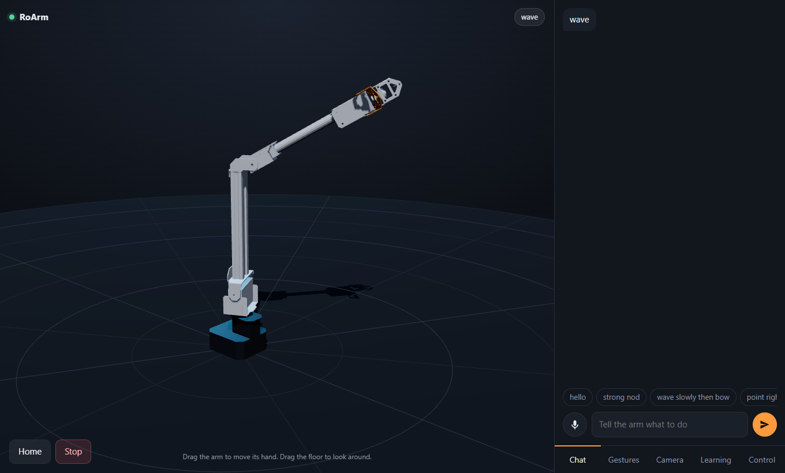

*The page under test: a three.js view of the simulated arm, with chat,
gesture cards, camera hand-over and joint sliders in the side panel.*

The server (`roarm_rl/server.py`) runs a headless PyBullet [3] model of the
arm at 60 ticks per second. Each tick it computes one joint vector
`[base, shoulder, elbow, gripper]`, poses the simulated arm with it, and
streams the link poses to browsers, which draw them and smooth between
updates. That simulated pose is what this paper calls **the picture**. With
the Mirror switch on, the same vector is sent to the real arm.

The picture moves along one of four shapes, depending on what the user did:

| Source in the page | Shape in time | Speed | Code |
| --- | --- | --- | --- |
| Gesture card, chat, voice | Catmull-Rom spline [4] through `(duration, pose)` keyframes, so velocity is continuous through each pose | Set by the keyframes; with Mirror on, segments are stretched so no joint needs more than 1.6 rad/s | `gesture.pose_at`, `gesture.fit_to_speed` |
| Joint sliders, Home | Straight line in joint space at constant speed (a ramp, with an abrupt start and stop) | 1.5 rad/s | `Robot._goal` in `server.py` |
| Dragging the hand in the 3D view | IK once for the dragged point, then the same ramp | 3.0 rad/s, 1.6 with Mirror on | `Robot.reach`, `RoArmSim.solve_ik` |
| Camera hand-over | One quintic per move that starts at the current position and velocity and ends at rest with zero acceleration (the minimum-jerk form [5]) | Peak 0.9 rad/s for the arm, 2.5 for the gripper | `server.Glide` |

How the picture becomes servo commands (`Robot._run`, the mirror block):

- A command is sent at most every 40 ms, and only if some joint's target
  moved more than 4 mrad since the last one sent. Measured: 19 to 20
  commands per second while moving.
- Gestures and hand-over moves are sent 0.18 s **ahead** of the picture, to
  cancel the arm's delay. Slider and drag ramps are not led.
- Each command carries a servo speed and acceleration. The app uses three
  settings: 1500 / 60 while following, 880 / 60 during planned hand-over
  moves, and 300 / 10 while closing the gap after Mirror is switched on.
- All targets are clamped to a safe box (`SAFE_BOUNDS`): base ±1.2 rad,
  shoulder −0.6 to 0.55, elbow 0.7 to 2.1, gripper 0 to 1.2.

### 2.3 Inverse kinematics

`RoArmSim.solve_ik` calls PyBullet's damped-least-squares solver [3][6] on
the URDF's `hand_tcp` frame with joint limits, 200 iterations, starting from
the simulated arm's current pose. The arm has no wrist, so only position is
solved: three joints for three coordinates. The web app calls it two ways.
A drag solves **once** from wherever the arm is. A hand-over resets to the
home pose and solves **four times**, feeding each answer back in.

## 3. Method

### 3.1 What "measured" means

Measured joint angles are the servos' own encoder readings, requested with
the firmware's feedback command and read back over the same serial link.

| Property | Value |
| --- | --- |
| Resolution | 1 count = 1.534 mrad |
| Sample rate | about 42 per second in the single-joint tests, about 15 during animations (see 3.3) |
| Time stamp | midpoint of request and reply, which are about 23 ms apart, so ±12 ms |
| Also logged | the load each servo reports, and the firmware's own hand position |

**What this cannot see.** The encoder sits on the servo's output shaft. Flex
in the links, play between shaft and link, and any error in the assumed
link lengths are invisible to it. Hand positions in this paper are computed
from measured joint angles through the URDF, so "hand error" means the
effect of joint error at the hand, not a tape-measure distance. A camera or
dial gauge would be needed for absolute hand accuracy; that was not done.
One cross-check was possible: the firmware reports its own computed hand
position, and over 216 settled poses it agreed with the URDF to 0.6 mm on
average (2.4 mm worst) after a fixed offset of (10.2, 0, 121.2) mm between
the two origins. So the two kinematic models agree with each other; neither
was checked against the physical arm.

### 3.2 Experiments

All are in `roarm_rl/benchmark.py`. Single-joint tests replicate the web
app's sending rule (40 ms, 4 mrad, same servo settings) in a small loop.
The animation test runs the web app's real `Robot` class with Mirror on.

| Experiment | What is commanded | Runs |
| --- | --- | --- |
| `static` | One joint at a time to 7 targets across its safe range by slider-style ramp, up then down, 3 cycles; 1 s dwell | 144 |
| `poses` | 24 random whole-arm poses, each visited twice in a different order | 48 |
| `step` | A single command of 0.05, 0.2, 0.5 (base also 1.0) rad at each of the three servo settings, both directions | 42 |
| `sine` | A sine on one joint, ±0.15 rad at 0.2 to 3 Hz and ±0.4 rad at 0.2 to 1 Hz | 44 |
| `stream` | One two-joint 0.5 Hz reference sent at different command rates, accelerations and speed caps | 10 |
| `limits` | A 1.5 and 2 Hz sine on the base at six speed / acceleration settings | 12 |
| `hold` | Stand still for 5 s at 8 shoulder angles × 3 elbow angles | 24 |
| `iksim` | IK on 2000 reachable targets and 1000 arbitrary ones, simulator only | 3000 |
| `ik` | 24 drag-style reaches on the real arm | 24 |
| `animations` | 19 animations, twice each, through the web app | 38 |

Before each run the arm was brought to the home pose slowly. It was left
holding between runs and returned to its original folded pose at the end.

### 3.3 A mistake caught in the method

The first animation run read the encoders back to back. Each read holds the
serial port for about 25 ms, and that starved the web app's own commands:
it got 3.5 commands per second through instead of 19, and the arm appeared
to trail the picture by 450 ms. That was the measurement disturbing the
thing measured. The logger now leaves the port free for 30 ms after each
read; commands went back to 18.9 per second and the result below is from
that rerun, at the cost of only about 15 encoder samples per second. That
is enough for motions that repeat about once a second, but brief peaks can
be missed, so "worst instant" figures for animations are lower bounds. The
logger still occupies the port a good third of the time, so a command can
be held up by up to about 25 ms that it would not be in normal use.
Animation results are therefore, if anything, slightly pessimistic on
timing.

## 4. At rest: accuracy and repeatability per joint

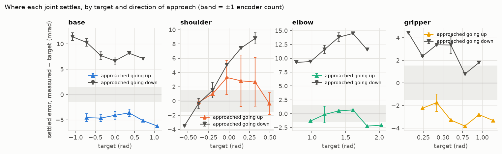

*Settled error for each joint by target. Coloured: target approached going
up. Grey: going down. Bars span the three cycles.*

| Joint | Mean error | RMS | Worst | Up minus down | Repeatability (1σ, same direction) | Noise at rest |
| --- | --- | --- | --- | --- | --- | --- |
| base | +1.9 | 7.1 | 12.3 | −12.4 | 0.71 | 0.03 |
| shoulder | +2.4 | 4.3 | 9.8 | −2.6 | 1.83 | 3.96 |
| elbow | +5.5 | 8.5 | 14.5 | −12.7 | 0.62 | 0.00 |
| gripper | −0.1 | 3.0 | 4.4 | −5.1 | 0.36 | 0.00 |

All in mrad; n = 36 settled readings per joint.

**The error is mostly dead band, not noise.** Base, elbow and gripper stop
short of the target on the side they arrive from. For the base that is
about 4.7 mrad short going up and 8.5 mrad short going down: a band of
roughly 8 encoder counts inside which the servo considers itself arrived.
The final command equalled the target in every one of these runs, so this
is the servo's behaviour, not the web app's 4 mrad sending threshold. (That
threshold can add to it in general: in the `poses` runs the last command
sent was up to 3.4 mrad from the goal.)

**The elbow also sags.** Its two curves are offset by a further +5.5 mrad,
in the direction gravity pulls the forearm. The single-command step test
shows the same +4.2 to +5.7 mrad.

**The shoulder behaves differently.** Its band is narrow but its readings
scatter (noise 4 mrad at rest, repeatability 1.8 mrad). That is the hunting
described in section 6.

**Repeatability is far better than accuracy.** Arriving the same way, a
joint lands within 0.4 to 0.7 mrad (under half a count) of where it landed
before; the shoulder within 1.8 mrad. So most of the error is systematic,
and could be compensated in software by always finishing a move from the
same side, or by adding the known offset.

**Whole-arm poses.** Over 24 random poses visited twice, the hand ended
3.0 mm from the commanded position on average (median 2.9, 95th percentile
5.3, worst 6.5 mm). Two visits to the same pose from different previous
poses ended 2.1 mm apart on average (worst 7.0 mm), which is the
direction-dependent dead band showing up at the hand.

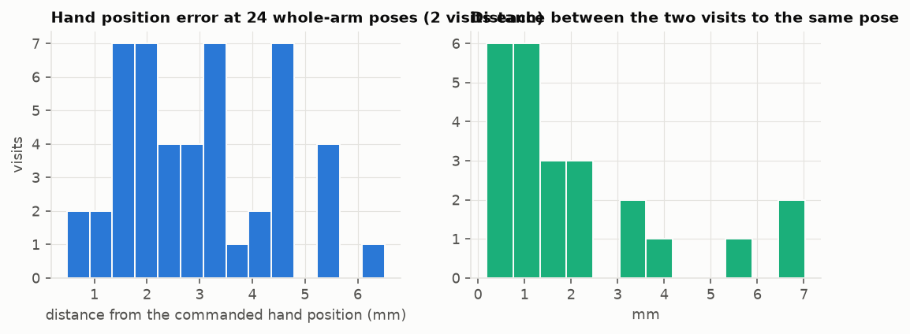

## 5. In motion: delay, speed and the limit of following

### 5.1 One command

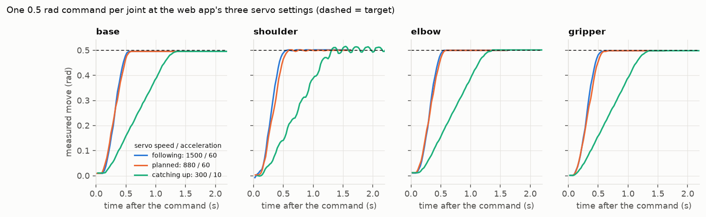

| Servo setting (speed / acc) | Dead time | 10 to 90% rise | Peak speed | Settled within 10 mrad |
| --- | --- | --- | --- | --- |
| following, 1500 / 60 | 86 to 137 ms | 0.26 to 0.29 s | 1.9 to 2.1 rad/s | 0.49 to 0.50 s |
| planned, 880 / 60 | 98 to 118 ms | 0.30 to 0.33 s | 1.5 to 1.6 rad/s | 0.52 to 0.59 s |
| catching up, 300 / 10 | 137 to 180 ms | 0.86 to 0.87 s | 0.5 to 0.7 rad/s | 1.3 to 1.7 s |

0.5 rad steps; ranges are across the four joints, each the mean of both
directions.

- Nothing moves for about 110 ms after a command (median of 42 steps; the
  time stamps are good to ±12 ms).
- At the "following" setting a joint accelerates at 8 to 9 rad/s² and tops
  out near 2 rad/s. The servo's speed unit is encoder counts per second
  [2], so 1500 nominally means 2.3 rad/s; the measured peak is a little
  under that.
- Base, elbow and gripper do not overshoot at all. The shoulder overshoots
  in one direction of travel by 7 to 10 mrad (10.6 mrad in the worst single
  step) and hardly at all in the other.
- The shoulder at the slow setting does not move smoothly: the trace
  ripples all the way up and keeps oscillating after arrival.

### 5.2 A moving command

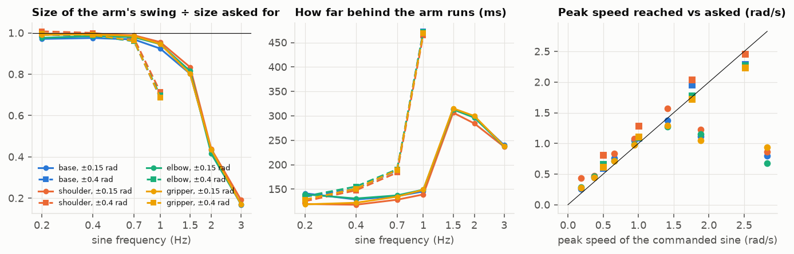

*Left: how much of the commanded swing the arm makes. Middle: how far
behind it is. Right: peak speed reached against peak speed asked.*

| Sine | Peak speed asked | Peak acceleration asked | Swing achieved | Delay |
| --- | --- | --- | --- | --- |
| ±0.15 rad, 0.2 to 0.7 Hz | 0.2 to 0.7 rad/s | up to 2.9 rad/s² | 97 to 100% | 118 to 141 ms |
| ±0.15 rad, 1.0 Hz | 0.94 | 5.9 | 92 to 96% | 139 to 149 ms |
| ±0.4 rad, 0.7 Hz | 1.76 | 7.7 | 96 to 97% | 184 to 190 ms |
| ±0.15 rad, 1.5 Hz | 1.41 | 13.3 | 80 to 83% | 306 to 315 ms |
| ±0.4 rad, 1.0 Hz | 2.51 | 15.8 | 69 to 71% | 465 to 473 ms |
| ±0.15 rad, 2.0 Hz | 1.88 | 23.7 | 42 to 44% | 284 to 300 ms |
| ±0.15 rad, 3.0 Hz | 2.83 | 53.3 | 17 to 19% | 237 to 240 ms |

Ranges are across the four joints, which behave almost identically.

**Inside its limits the arm is a pure delay.** Up to 1 Hz at small
amplitude the swing is within 3% of what was asked and the arm is simply
120 to 135 ms late (base 135, shoulder 122, elbow 136, gripper 125 ms).
The web app's lead of 180 ms is therefore about 50 ms more than needed in
steady motion; section 8 shows the arm running 5 to 22 ms *ahead* of the
picture in slow shapes.

**The tracking error while moving is the delay times the speed.** A sine
that peaks at 0.94 rad/s shows about 90 mrad RMS of error against an
un-led reference, nearly all of it timing. With the delay removed, the
`stream` test leaves 7 mrad RMS.

**Following breaks at an acceleration, not a frequency.** The ±0.4 rad
sine fails at 1 Hz while the ±0.15 rad sine is still fine there; what they
have in common when they fail is a peak acceleration above roughly 8 to
13 rad/s², which matches the 8 to 9 rad/s² seen in the step test. Speed
alone does not predict it: 1.76 rad/s is followed, 1.41 rad/s at higher
acceleration is not.

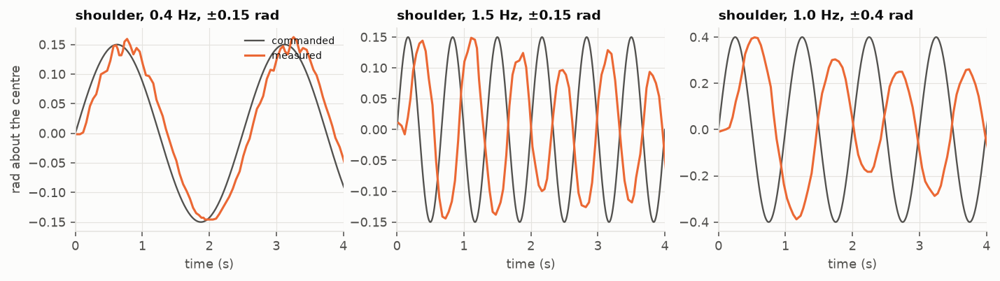

*The shoulder at three sines: followed; too quick, so the swing shrinks and
the shape distorts; too large and quick, so it turns into a late triangle
wave.*

### 5.3 Do the servo settings or the command rate matter?

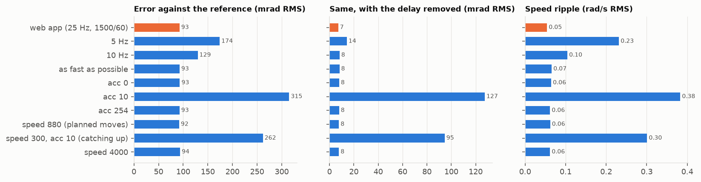

For a reference well inside the limits (0.5 Hz):

- Sending 20 times a second with any acceleration setting from 60 up, or
  any speed cap from 880 up, gives the same result: 155 ms delay, 7 to 8
  mrad RMS left over, speed ripple 0.05 to 0.07 rad/s.
- Sending less often is worse in proportion: 10 per second adds 60 ms of
  delay and doubles the ripple; 5 per second adds 140 ms and makes the
  motion visibly stepped (ripple 0.23 rad/s).
- The slow settings (acceleration 10, or 300 / 10) cannot follow a moving
  target at all: 500 ms behind and 95 to 127 mrad off even after alignment.
  They are only used for the initial catch-up, where that is intended.

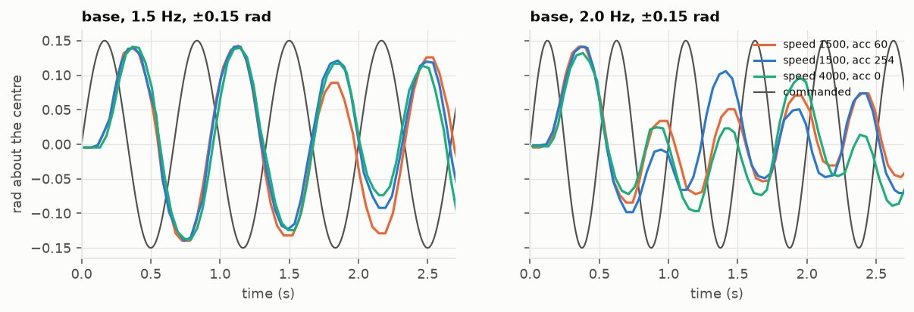

For a reference beyond the limits (1.5 and 2 Hz), raising acceleration to
150, 254 or 0 (the servo's "no limit") and the speed cap to 4000 changed
nothing: the swing stayed at 79 to 81% and 40 to 44%. The limit is in the
arm, not in the settings the web app chose. We did not establish whether
it is motor torque or something in the servo's or controller's firmware.

## 6. Stability

"Unstable" here means the joint moves by more than 4 encoder counts
(6 mrad) peak to peak while its target is constant.

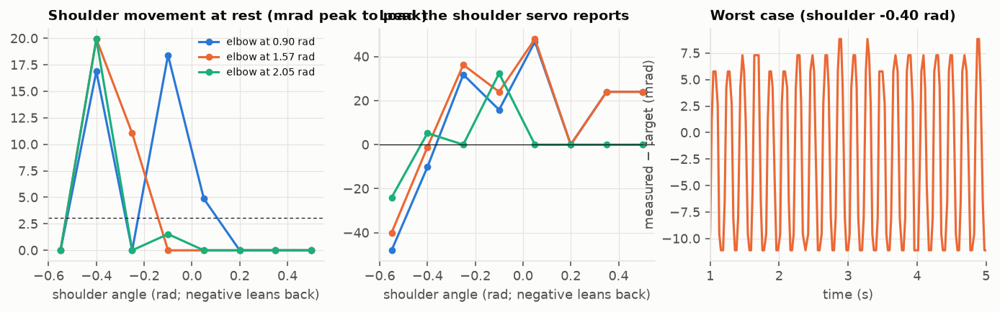

*Left: shoulder movement at rest against shoulder angle, for three elbow
angles (dashed line = 2 counts). Middle: the load the shoulder servo
reports. Right: the worst case over time.*

**Base, elbow on its own account, and gripper never moved at rest**: zero
counts of movement in all 24 holds for base and gripper.

**The shoulder hunts in a band of poses.** In 5 of 24 holds it oscillated
continuously, never settling in 5 s:

| Shoulder | Elbow | Shoulder movement | Frequency | Load reported |
| --- | --- | --- | --- | --- |
| −0.40 rad | 0.90 | 16.9 mrad p-p | 4.2 Hz | −10 |
| −0.40 | 1.57 | 19.9 | 5.0 Hz | −1 |
| −0.40 | 2.05 | 19.9 | 5.8 Hz | +5 |
| −0.10 | 0.90 | 18.4 | 4.2 Hz | +16 |
| −0.25 | 1.57 | 11.0 | slow drift | +36 |

At −0.55 rad and from +0.2 rad forward it was perfectly still in every
case. Twenty mrad at the shoulder moves the hand by up to about 10 mm, and
it drags the elbow reading along by up to 6 mrad.

**When it happens.** The hunting is centred where the reported shoulder
load passes through zero, that is, where the arm's weight is balanced over
the shoulder. Our reading (an interpretation, not something we measured
directly): with no steady load to hold the gears against one face, the
joint sits inside its backlash, and the two shoulder servos, each with its
own position loop and dead band, push it back and forth. A steady gravity
load in either direction stops it. The band is not sharp: −0.25 rad was
quiet for two elbow angles and drifting for the third.

**Other places it showed up.**

- After a nod, with the shoulder back at 0, it rang by about ±10 mrad for
  over a second (section 8).
- In the static test, at −0.37 and −0.20 rad, it oscillated ±8 mrad
  through the whole 1 s dwell.
- With the slow 300 / 10 setting it rippled during the move and after it
  at +0.25 rad, a pose that is quiet at the fast setting. So the web app's
  gentle catch-up is the least stable way to move this particular joint.
- Traced shapes that need shoulder and elbow to move slowly against each
  other (`line_forward`, `circle_side`) came out visibly jagged, with
  about ±5 mm of zigzag, where shapes led by the base were smooth.

**What was not unstable.** No joint ran away, grew in oscillation, or
overshot a step by more than 10.6 mrad. No command was refused. Following
beyond the limits in section 5 degrades into a smaller, later, distorted
copy of the command; it does not become erratic. The shoulder's hunting is
bounded and stops as soon as the pose changes.

## 7. Inverse kinematics

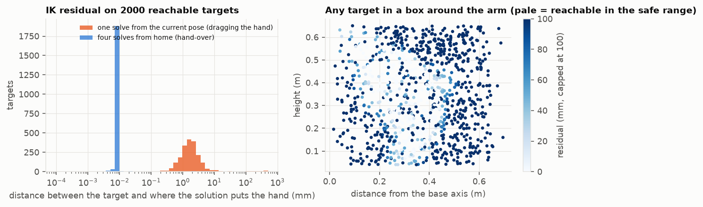

*Left: where the IK solution puts the hand, against where it was asked to,
on 2000 targets known to be reachable. Right: the same for arbitrary
points in a box around the arm.*

| How it is called | Median miss | 95th percentile | Worst | Over 1 mm | Over 10 mm |
| --- | --- | --- | --- | --- | --- |
| Once, from the current pose (drag) | 1.7 mm | 6.6 mm | 484 mm | 80% | 3.7% |
| Four times, from home (hand-over) | 0.009 mm | 0.010 mm | 13.7 mm | 1.7% | 0.1% |

One solve takes about 0.4 ms, so four cost nothing noticeable.

- The single solve is not converged. It usually lands within a few
  millimetres, but in 1 target in 27 it is more than a centimetre off, and
  occasionally it does not get there at all. The README's earlier statement
  that IK "converges to sub-millimetre accuracy" holds only for the
  repeated solve.
- While dragging, the page keeps sending new targets and each solve starts
  from the last result, so a continuous drag refines itself. The single
  solve matters for a tap, or the last event of a quick drag.
- For arbitrary points only 19% can be reached within 5 mm inside the safe
  joint range; the rest return the nearest pose the solver finds, silently.
  The hand-over code checks this residual and refuses targets more than
  3.5 cm off; the drag path does not check.

**On the real arm**, 24 drag-style reaches (IK once, then a ramp at
1.6 rad/s):

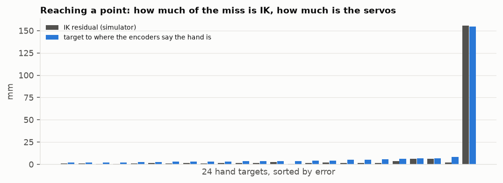

| | Median | Mean | Worst |
| --- | --- | --- | --- |
| IK residual in the simulator | 1.5 mm | | 155.6 mm |
| Target to where the encoders put the hand | 3.8 mm | 10.4 mm | 154.6 mm |
| Of which the servos (solution to encoders) | | 2.8 mm | |

The typical reach ends about 4 mm from the target, roughly half from the
unconverged solve and half from the servos' dead band. One reach of 24
ended 155 mm away, entirely because the single solve failed; the arm went
exactly where it was told.

## 8. Animations

### 8.1 The set

Nineteen animations, each played twice through the web app with Mirror on.

- **Ten library gestures** as the page plays them: `nod`, `nod_fast_big`,
  `wave`, `bow`, `shake`, `circle`, `figure_eight`, `dance`,
  `celebrate_big`, `stir_slow`.
- **Nine traced shapes** made for this study, each 10 to 16 cm across,
  centred 30 cm in front of the arm at 36 cm height: a circle facing the
  arm, a circle flat over the table, a circle in the arm's own plane, a
  figure eight, a two-turn spiral, a square, a triangle, a line forward and
  back, and a line up and down. Each is 16 to 32 points on the ideal path,
  turned into joint keyframes by the four-pass IK and played through the
  same spline as any gesture, over 5 to 7 s.

### 8.2 The rubric

Each run starts at 10 and loses points for five things. The weights are a
judgement; the raw quantities are in the table so the reader can apply
their own.

| Loses | For | Cap |
| --- | --- | --- |
| 1 point per 5 mm | RMS distance of the hand from the picture, at the same instant | 4 |
| 1 point per 50 ms | delay of the arm against the picture (either sign) | 2 |
| 1 point per 5% | of any joint's commanded range that the arm did not cover | 2 |
| 1 point per 3 mm | RMS difference between the two runs | 1 |
| 1 point per 5 mm | distance from the picture once both have stopped | 1 |

Reading the score: 8 and above is hard to tell from the picture by eye;
6 to 8 is a faithful copy with small visible differences; 4 to 6 is clearly
the same motion but loose; under 4 has moments where the arm is visibly
somewhere else.

### 8.3 Results

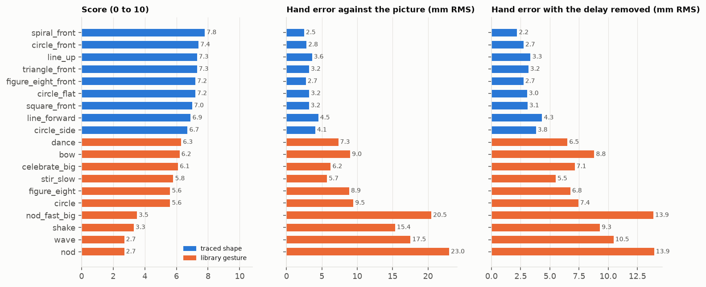

| Animation | Kind | Designed → played (s) | Hand RMS (mm) | Of motion size | Hand worst (mm) | Delay (ms) | Reach kept | Run to run (mm) | Off the ideal shape (mm) | Score |
| --- | --- | --- | --- | --- | --- | --- | --- | --- | --- | --- |
| spiral_front | shape | 8.6 → 8.6 | 2.5 | 3.1% | 6.8 | −12 | 96% | 1.4 | 1.5 | **7.8** |
| circle_front | shape | 6.6 → 7.2 | 2.8 | 4.0% | 6.1 | −10 | 96% | 2.0 | 1.6 | **7.4** |
| triangle_front | shape | 7.6 → 7.6 | 3.2 | 4.4% | 9.3 | −5 | 96% | 1.6 | 2.1 | **7.3** |
| line_up | shape | 6.6 → 6.6 | 3.6 | 4.8% | 8.2 | −12 | 98% | 1.4 | 1.6 | **7.3** |
| circle_flat | shape | 6.6 → 6.6 | 3.2 | 4.6% | 6.4 | −15 | 96% | 1.3 | 2.9 | **7.2** |
| figure_eight_front | shape | 8.1 → 8.1 | 2.7 | 3.3% | 6.7 | −10 | 96% | 1.4 | 2.0 | **7.2** |
| square_front | shape | 8.1 → 8.1 | 3.2 | 4.1% | 7.3 | −10 | 95% | 1.6 | 1.9 | **7.0** |
| line_forward | shape | 6.6 → 6.6 | 4.5 | 5.6% | 9.7 | −12 | 99% | 2.7 | 3.7 | **6.9** |
| circle_side | shape | 6.6 → 6.6 | 4.1 | 5.8% | 11.8 | −22 | 99% | 3.7 | 2.3 | **6.7** |
| dance | gesture | 4.0 → 5.9 | 7.3 | 4.1% | 22.4 | 8 | 97% | 3.2 | | **6.3** |
| bow | gesture | 2.5 → 2.5 | 9.0 | 3.6% | 36.1 | 3 | 99% | 5.7 | | **6.2** |
| celebrate_big | gesture | 2.6 → 9.6 | 6.2 | 1.6% | 34.0 | 18 | 97% | 4.0 | | **6.1** |
| stir_slow | gesture | 7.5 → 7.5 | 5.7 | 2.9% | 15.2 | −7 | 95% | 3.9 | | **5.8** |
| circle | gesture | 3.2 → 5.2 | 9.5 | 4.6% | 33.5 | 18 | 98% | 3.4 | | **5.6** |
| figure_eight | gesture | 3.9 → 6.2 | 8.9 | 4.3% | 39.6 | 18 | 97% | 4.4 | | **5.6** |
| nod_fast_big | gesture | 1.0 → 4.1 | 20.5 | 8.1% | 70.6 | 35 | 98% | 5.1 | | **3.5** |
| shake | gesture | 1.8 → 4.2 | 15.4 | 9.1% | 45.4 | 35 | 93% | 4.1 | | **3.3** |
| nod | gesture | 1.6 → 4.0 | 23.0 | 11.1% | 88.5 | 43 | 96% | 8.3 | | **2.7** |
| wave | gesture | 2.6 → 4.5 | 17.5 | 6.3% | 45.6 | 53 | 94% | 2.9 | | **2.7** |

Each row is the mean of two runs, except "hand worst", which is the worst
instant of either. A negative delay means the arm was ahead
of the picture.

| | Shapes (9) | Gestures (10) | All (19) |
| --- | --- | --- | --- |
| Mean score | 7.2 | 4.8 | 5.9 |
| Hand RMS from the picture | 3.3 mm | 12.3 mm | 8.0 mm |
| As a share of the motion's size | 4.4% | 5.6% | 5.0% |
| Worst instant | 11.8 mm | 88.5 mm | 88.5 mm |
| Arm joints RMS | 6 mrad | 23 mrad | 15 mrad |
| Played duration ÷ designed | 1.0 | 2.1 | |

Per joint, averaged over all 19: base 13 mrad RMS, shoulder 7, elbow 16,
gripper 7.

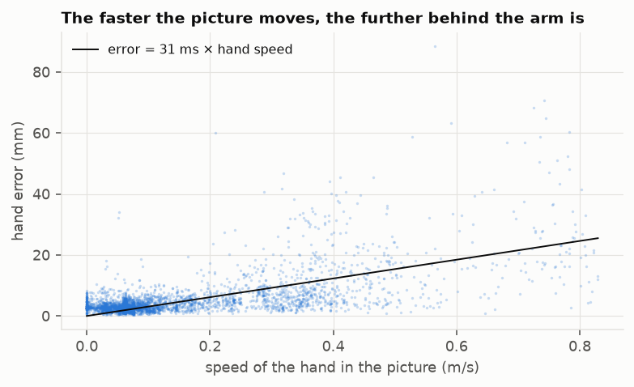

*Every sample of every animation run. Hand error grows with how fast the
picture's hand is moving, by about 31 mm per m/s (equivalent to being 31 ms
late), from a floor of about 3 mm when the picture is still.*

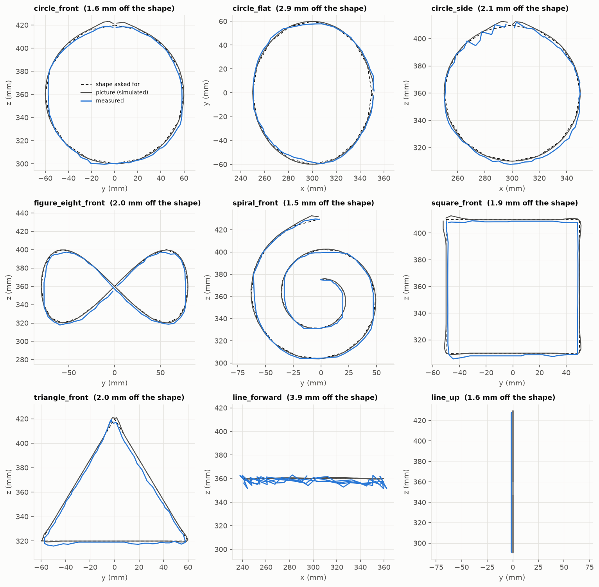

*Each traced shape in its own plane: the ideal shape (dashed), the picture
(grey) and the hand as computed from the encoders (blue).*

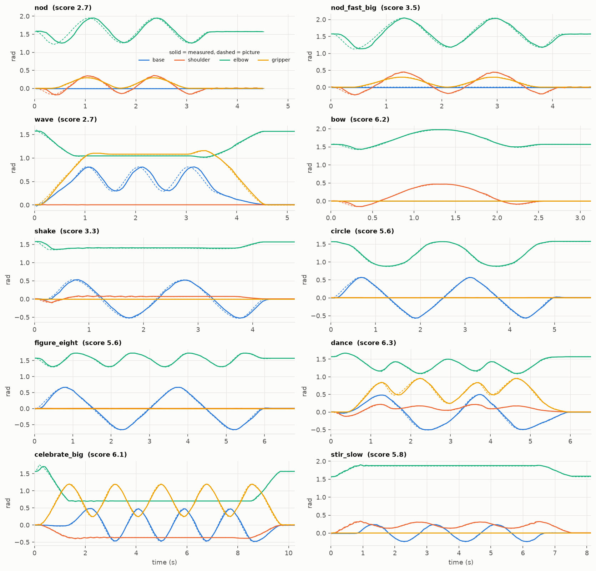

*The ten gestures, joint by joint: dashed is the picture, solid is the arm.*

One figure per animation, with every joint, the hand error over time and
both runs, is in [figures/animations/](figures/animations/).

### 8.4 Judgement

**Slow, smooth motion is reproduced well.** The nine shapes move the hand
at no more than 8 to 17 cm/s. The arm stayed within 2.5 to 4.5 mm RMS of the
picture and 1.5 to 3.7 mm of the ideal geometric shape, and two runs of the
same shape differed by 1.3 to 3.7 mm. What separates these from a perfect
score is small and systematic: the drawn square sits about 2 mm low and
inside (elbow sag and dead band), about 4% of each joint's range is lost
to the dead band at the turning points, and the arm leads the picture by
5 to 22 ms because the web app's lead is a little generous.

**The spline itself adds almost nothing.** The picture is 0.3 to 1.3 mm
RMS off the ideal shape, mostly small overshoots where the Catmull-Rom
curve rounds the corners of the square and triangle. The arm, not the
maths, is the larger part of the 2 mm.

**Shapes that lean on the shoulder are rougher.** `line_forward` and
`circle_side` are drawn by shoulder and elbow working against each other,
and they came out with a visible zigzag and the lowest shape scores. This
is the shoulder behaviour from section 6 appearing in motion.

**Quick gestures lose most at the start and at reversals.**

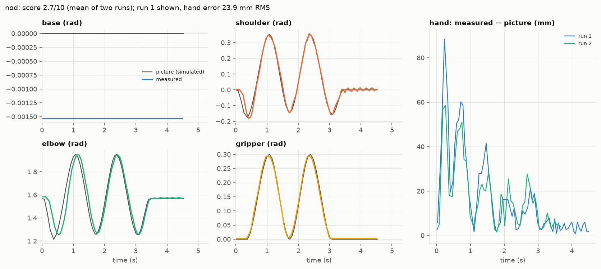

- *The start.* A gesture's spline begins at full speed from a standstill,
  and it begins the moment it is requested, so the 180 ms lead has nothing
  to work with. The arm starts about 0.2 s late and spends the first half
  second catching up. In `nod` that is the 60 to 90 mm spike at 0.2 s, the
  worst instant in the whole study, on a motion whose hand moves up to 208 mm from its start.
- *Reversals.* Even after stretching to 1.6 rad/s, a nod or wave reverses
  direction harder than 8 rad/s², so the arm cuts 30 to 50 ms behind
  through each turn (`wave` base: 62 mrad RMS, 166 mrad worst).
- *The end.* After `nod` the shoulder rings for over a second at home.

**Nothing went wrong in kind.** Every animation was recognisably itself,
the arm covered 93 to 99% of each joint's commanded range, there was no
stall, no reversal against the command and no growing oscillation.

**Deviation from the animation as designed.** The comparison above is with
the picture, which the web app has already slowed down. Against the
keyframes as written:

- *Tempo* is the big change. Shapes and the slow gestures play at their
  designed length. Quick gestures are stretched: `nod` from 1.6 to 4.0 s
  (2.5 times), `wave` 1.7 times, `shake` 2.3 times, `celebrate_big` 3.7
  times, `nod_fast_big` from 1.0 to 4.1 s (3.9 times).
- The "fast" and "normal" versions of a gesture end up almost the same
  length on the real arm (4.1 s and 4.0 s for the nod), because both hit
  the same speed cap. The speed choice on the gesture card has little
  effect while mirroring.
- *Path and reach* are kept: the poses are the designed ones.

So, in one sentence: on this arm a designed animation keeps its shape to
within about 5% of its size and loses up to three quarters of its speed.

## 9. Limitations

- One arm, one session, no payload, one room temperature. Servo dead band
  and backlash vary between units and with wear.
- Encoder-based (section 3.1): link flex and play beyond the servo shaft
  are not measured, and no external reference was used.
- Two runs per animation and three cycles per static target. Spreads are
  given, but these are small samples.
- The logger shares the serial port with the commands (section 3.3).
- Time stamps are good to about ±12 ms, so delays are known to about that.
- Only USB serial was tested. Over Wi-Fi the arm sends no feedback, and its
  delay is probably different.
- The camera hand-over's quintic moves were characterised only through the
  step and sine tests at their servo setting, not replayed end to end here.
- The cause of the shoulder hunting and of the acceleration limit is
  inferred from when they occur, not confirmed by changing the hardware or
  the servo's internal gains.
- The simulated picture was compared with the arm; the browser's drawing of
  that picture (which adds its own smoothing of a few frames) was not.

## 10. Conclusions and recommendations

1. **Budget for 3 to 9 mrad per joint and about 3 mm at the hand at rest**,
   6.5 mm worst. If a task needs better, finish every move from the same
   direction: same-direction repeatability is under 1 mrad for three joints.
2. **Treat the arm as a 125 ms delay with a 2 rad/s, 8 rad/s² envelope.**
   Inside it, tracking error after alignment is about 7 mrad.
   `fit_to_speed` enforces the speed half of that; it does not look at
   acceleration, and that is where gestures now lose accuracy.
3. **Give gestures a soft start.** Either ease the first segment in from
   zero velocity or hold the picture for the lead time before it moves.
   This would remove the largest single error measured (88 mm in `nod`).
4. **Trim the lead from 0.18 s to about 0.13 s.** Slow motion currently
   runs 10 to 20 ms ahead of the picture.
5. **Solve IK more than once on the drag path**, as the hand-over path
   already does, and check the residual. It costs about a millisecond and
   removes both the typical 1.7 mm miss and the rare gross one.
6. **Avoid resting the shoulder near its balance point** (around 0.4 rad
   back with the forearm forward), and avoid the 300 / 10 setting for the
   shoulder. A slightly different rest pose is quiet.
7. **Keep sending at 20 per second or more.** The servo settings above
   60 / 880 are interchangeable; the command rate is not.
8. **When measuring, do not hog the serial port** (section 3.3).

## 11. References

1. Waveshare, *RoArm-M2-S* product wiki.
   <https://www.waveshare.com/wiki/RoArm-M2-S>
2. Waveshare, *ST3215 Servo* wiki (12-bit magnetic encoder, 360°/4096,
   30 kg·cm at 12 V, speed in steps per second).
   <https://www.waveshare.com/wiki/ST3215_Servo>
3. E. Coumans and Y. Bai, *PyBullet, a Python module for physics simulation
   for games, robotics and machine learning*, 2016–2021.
   <https://pybullet.org>
4. E. Catmull and R. Rom, "A class of local interpolating splines," in
   *Computer Aided Geometric Design*, Academic Press, 1974, pp. 317–326.
5. T. Flash and N. Hogan, "The coordination of arm movements: an
   experimentally confirmed mathematical model," *Journal of Neuroscience*,
   vol. 5, no. 7, pp. 1688–1703, 1985.
6. S. R. Buss, *Introduction to inverse kinematics with Jacobian transpose,
   pseudoinverse and damped least squares methods*, University of
   California San Diego, 2004.
7. ISO 9283:1998, *Manipulating industrial robots: performance criteria and
   related test methods*. The pose accuracy and repeatability measures in
   section 4 follow its definitions in spirit; its test cube, cycle counts
   and external measuring equipment were not used.
8. This repository: `roarm_rl/server.py`, `roarm_rl/gesture.py`,
   `roarm_rl/sim.py`, `roarm_rl/library.py`, `roarm_rl/benchmark.py`,
   `roarm_rl/benchmark_report.py`.

## 12. Reproducing

```
pip install -r requirements.txt matplotlib

# with the arm on USB; each writes docs/paper/data/<name>.json
python -m roarm_rl.benchmark static
python -m roarm_rl.benchmark poses
python -m roarm_rl.benchmark step
python -m roarm_rl.benchmark sine
python -m roarm_rl.benchmark stream
python -m roarm_rl.benchmark limits
python -m roarm_rl.benchmark hold
python -m roarm_rl.benchmark ik
python -m roarm_rl.benchmark animations
python -m roarm_rl.benchmark iksim        # no arm needed

# figures, tables.md and results.json from the logs
python -m roarm_rl.benchmark_report
```

The arm moves through its whole safe range during these runs: clear the
space around it first. The full set takes about 25 minutes. All commands
stay inside `SAFE_BOUNDS`, and the arm is left holding at home.

Log format: each run has `t` (seconds), `q` (measured joint radians),
`ref` (what was wanted at that instant), `load` (as reported by the
servos), `xyz` (the firmware's hand position in mm) and `sent` (each
command with its time). Animation runs also carry `picture` (the simulated
arm over time), `designed` and `played` keyframes, and for shapes the ideal
`path`.
